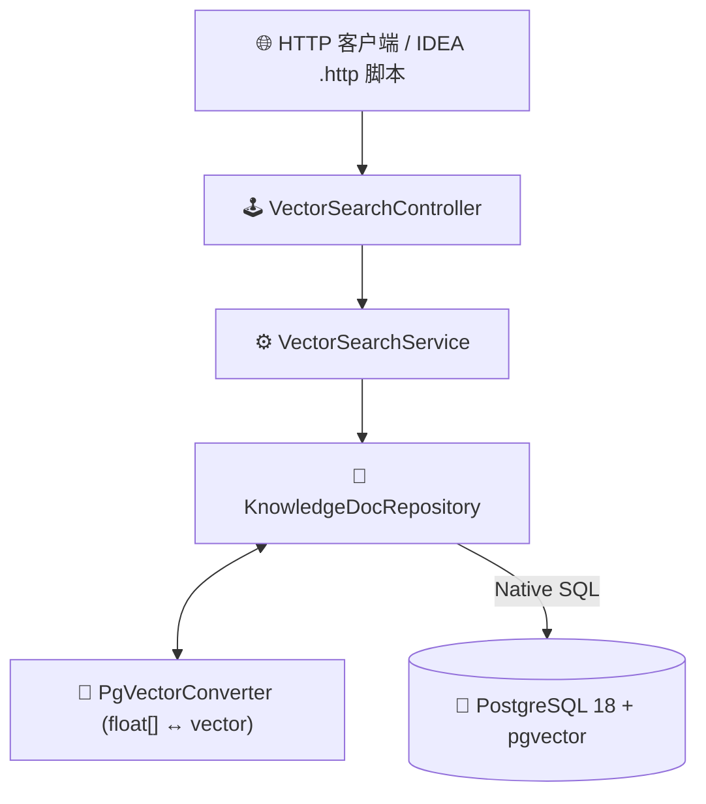

# 🏛️ 架构设计与核心原理

> 💡 **这是一个轻量级的 Demo 架构说明，帮助快速了解 Spring Boot 与 PgVector 如何结合。**

---

## 🧭 一、 架构与数据流向

整个 Demo 的分层非常清晰简单：



---

## 🧱 二、 核心类结构

* 🕹️ [`VectorSearchController`](../src/main/java/org/riseopc/controller/VectorSearchController.java)：提供向量检索、批量导入 Mock 向量、压测与清空数据的 REST 接口。
* ⚙️ [`VectorSearchService`](../src/main/java/org/riseopc/service/VectorSearchService.java)：负责多模式检索路由、JdbcTemplate 批量快速灌入、Flat vs HNSW 性能与召回率对比。
* 💾 [`KnowledgeDocRepository`](../src/main/java/org/riseopc/repository/KnowledgeDocRepository.java)：使用 Spring Data JPA 原生 SQL，直接调用 PostgreSQL 的 `<=>`、`<->`、`<#>` 向量算子。
* 🔄 [`PgVectorConverter`](../src/main/java/org/riseopc/converter/PgVectorConverter.java)：JPA 类型转换器，实现 Java `float[]` 与 PG 字符串/向量格式的透明双向转换。
* 🧮 [`VectorUtils`](../src/main/java/org/riseopc/util/VectorUtils.java)：纯数学小工具，提供向量 L2 归一化、余弦相似度计算与随机向量生成。

---

## ⚡ 三、 向量算子说明

| 度量类型 | 操作符 | 说明 | 公式 |
| :--- | :---: | :--- | :--- |
| **余弦距离** | `<=>` | 最常用，用于文本语义匹配 | $\text{Cosine Sim} = 1 - (u \Leftrightarrow v)$ |
| **L2 欧氏距离** | `<->` | 空间几何直线距离 | $\text{Euclidean} = \|u - v\|_2$ |
| **负内积** | `<#>` | 归一化向量快速打分 | $\text{Inner Product} = u \cdot v$ |

---

## 🔍 四、 混合检索（Hybrid Search）

直接在 SQL 中组合标量字段与向量距离排序：

```sql
SELECT d.id, d.title, d.category, d.view_count,
       (1 - (d.embedding <=> CAST(:vectorStr AS vector))) AS similarity
FROM knowledge_doc d
WHERE (CAST(:category AS varchar) IS NULL OR d.category = CAST(:category AS varchar))
  AND (CAST(:minViewCount AS integer) IS NULL OR d.view_count >= CAST(:minViewCount AS integer))
  AND (1 - (d.embedding <=> CAST(:vectorStr AS vector))) >= :minSimilarity
ORDER BY d.embedding <=> CAST(:vectorStr AS vector)
LIMIT :limit;
```
